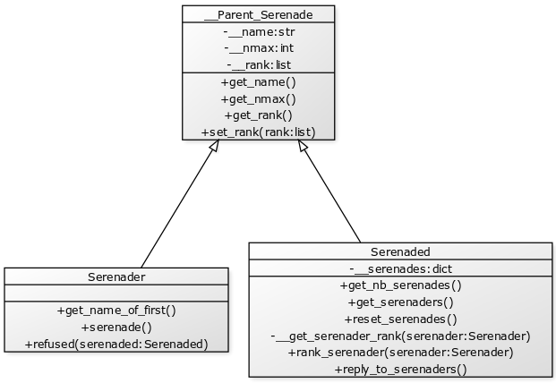

BÉDEX Antoine

BAICHOO Esteban

# Report - Stable Marriage Algorithm

[TOC]

## Objective of the project

The aim of this project is to implement the stable marriage algorithm (Gale-Shapley) that we studied in "Graph Theory" lesson in the IT training of Enseeiht, Toulouse.

We had to let the user able to create source files and / or to modify existing ones. A source file contains two groups on which apply the algorithm. We also had to let the user choose the group who serenade. We were free to choose the programming language to develop this algorithm and the technology / syntax of source files.

We decided to go with Python because it's an high-level language which is quite simple to use and very flexible. However, Python isn't robust and performing. If we had to make this algorithm efficient for an high-number of elements, we would choose C++, Rust, or another low-level language.

Regarding source files, we decided to use the YAML language. It is an alternative of XML / JSON. YAML has the advantage of being human-readable. Indeed, its syntax is minimal. Another reason for choosing YAML is the fact that Python has a YAML parser called PyYAML which make YAML files easy to use in Python.

## Description of the stable marriage problem

The stable marriage algorithm responds to the problem of finding a stable matching between two groups of elements. It is required for all elements of a group to rank all elements from the other group. A marriage is qualified as unstable if a member from group 1 prefer a member of group 2 than its current partner, and that the same element from group 2 prefer the same element from group 1 than its partner.

The Gale-Shapley algorithm solve this problem by matching all elements from one group to an element of the other group. Even if there may still be jealous elements, they will not be able to cheat on their spouses.

This algorithm can be used in both IT and economics. One can easily imagine its application to the problem of assigning students to universities (for example, the French platform "Parcoursup" uses a modified version of the Gale-Shapley algorithm). It could also be used to match couples of men and women.

To understand the algorithm, our professor used the metaphor of multiple men doing a serenade under the balcony of a different woman, each day. A woman will choose the man who is ranked highest between all propositions she received, and keep him until another man serenade her. If she prefer this new man, then the first man will have to serenade to the next woman in his ranked list. The algorithm stops when all elements are matched with another and there is no possibility of cheating on a spouse. An element can accept multiple elements of the other group as long as its capacity allows it (in this case, it is called a polygamy matching).

In order to make our algorithm "generic" (we didn't wanted to name groups universities / students, or men / women), we named groups "Group 1" and "Group 2". We also used the terms "Serenaders" and "Serenadeds" which are not grammatically correct. "Serenaders" represents the group who will be doing the serenade, while "Serenadeds" is the group that will receive serenades.

## How we implemented the algorithm

In this section, I will only describe implementation of the stable marriage algorithm. Indeed, I will skip the part about the check of source files and how we load data from it, because it just consists in manipulating Python data types and it's not really interesting. Just note that we have a `check_yaml` procedure which checks a source file and exit the program if an error is found.

We used 2 concrete classes and 1 abstract class. The abstract class (`__Parent_Serenade`) contain generic attributes and methods for both `Serenader` and `Serenaded` class. These classes are described in the following diagram:



We'll not deeply explain what the classes methods do because the code is quite simple.

Finally, we have the `stable_marriage_algorithm` program which take the sources, load the data from it, and loop the algorithm till its end. As we said earlier, the first part isn't interesting. Here's the code of the second part:

```python
""" Loop the algorithm till its end """
serenade_end : bool = False
while not serenade_end:
    serenade_end = True
    """ First, each serenader has to serenade """
    for serenader in serenaders.values():
        serenader.serenade()
    """ Next, each serenaded replies to his serenaders """
    for serenaded in serenadeds.values():
        serenaded.reply_to_serenaders()
    """ Finally, if a serenaded has less serenades than his nmax, we do another loop """
    for serenaded in serenadeds.values():
        if serenaded.get_nmax() < serenaded.get_nb_serenades():
			serenade_end = False
        	serenaded.reset_serenades()

""" Print results """
for serenader in serenaders.values():
	print(f"{serenader.get_name()} : {serenader.get_name_of_first()}")
```

This code is a simple implementation of the following pseudo-code:

```c
finished <- False
while not finished loop
	finished <- True
	each serenader serenade to his first choice
	each serenaded element reply to its serenaders
	if a serenaded element has more serenades than its maximum capacity
		finished <- False // loop again
	end if
end loop
```

When replying to serenaders, a serenaded element decline or accept a serenader element. If a serenader is declined, he will remove his first choice from his list of choices and go to the next element.

## How to use the source files

Source files use the YAML syntax.

Here's an example of a source file (this is a very short example with 2 elements per group):

```yaml
group1_serenading: True
group1:
  - name: "A"
    rank:
      1: "Beta"
      2: "Alpha"
    nmax: 1
  - name: "B"
    rank:
      1: "Alpha"
      2: "Beta"
    nmax: 1

group2:
  - name: "Alpha"
    rank:
      1: "A"
      2: "B"
    nmax: 1

  - name: "Beta"
    rank:
      1: "B"
      2: "A"
    nmax: 1
```

Now, let's understand how it works:

- We have a `group1_serenading` boolean which indicates:
  - That group 1 will be doing the serenade if `True`
  - That group 2 will be doing the serenade if `False`
- A `group1`, which is a list of elements (new element begin with `-`). Each element contains:
  - A `name` for the element
  - A `rank` containing a `key` / `value` dictionary:
    - A `key` represents the rank of an element of the other group
    - A `value` represents the name of an element of the other group
  - A `nmax` which is equal to the maximum number of accepted elements from the other group (only relevant when the element is serenaded)

In the project archive, you'll find to source files. The first one contain one of the examples we did in class (with two groups, [A, B, C, D] and [Alpha, Beta, Gamma, Delta], and no polygamy). We created the second one and it's an example of students and universities with polygamy (because one university can have multiple students).

## How to use the script

WARNING: This script only works with Python 3.X.

You must install `PyYAML` package in order to make this script parse a source file.
Install it by using `pip install PyYAML`.

If you do not have `pip`, just install it with the following command `sudo apt install python3-pip`
(or another depending on your distribution).
Make sure you use the version 3 of `pip`. Possibly, replace `pip` by `pip3` in the previous commands. If you are using version 2, it will install `PyYAML` for Python 2.X.


You have to pass an argument to the script (which is named `sma.py`), as in the following example:

```bash
python sma.py sources.yml
```

Here, `sources.yml` is a source file as we saw earlier.
